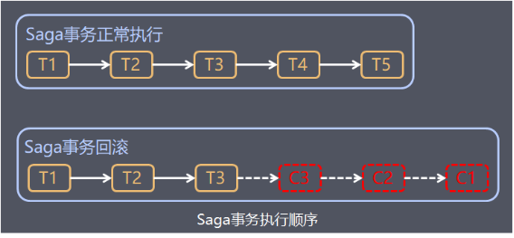

# 分布式事务

分布式事务：不同于数据库的本地事务，不同服务通过网络协同完成的事务

事务的四大特性

- A 原子性 一个事务中的所有操作，要么全部完成，要么全部失败。

- I 隔离性 并发事务操作相同数据，只能看到另一个事务操作前或后的数据，无法看到中间态数据。

- C 一致性。 前后必须都处于一致状态，错误了回滚到开始的一致状态。

- D 持久性。事务成功后，更新永久保存(即使系统崩溃重启)

 

单体架构时代Mysql数据库如何实现事务

1. 锁机制->隔离性

2. undo log逻辑日志->一致性，记录事务中的写操作，回滚时执行相反操作。delete对应insert。

3. redo log物理日志，事务提交时先将事务日志写入redo log持久化。

分布式架构下分库分表，跨数据库无法保证强一致性，只需要达到最终一致性。

BASE理论 （AP理论的延申。P分区容错性必须保证，A可用性和C一致性无法同时满足。）

- BA 基本可用 接受时间和功能上的损失。
- S 软状态，允许数据同步的延时，数据有中间状态。
- E 最终一致性。定时对账。

## 常用协议

`两阶段提交`

* 准备阶段，协调者让参与者执行事务，但不提交

* 提交阶段，协调者让参与者提交或回滚事务，参与者全部执行成功才提交，但凡有一个失败就全部回滚

  (如果提交阶段参与者没收到，协调者会不断重试。参与者收到却宕机，会使用redo log提交事务)

缺点：过度依赖协调者，参与者和协调者都在堵塞，参与者在执行完事务等待提交时会锁定资源，而协调者发送完执行请求后会阻塞一直等待执行结果。

`三阶段提交`

解决的问题：参与者执行了事务占据了资源，却因为别的参与者失败了。

三阶段：

* 准备前阶段：协调者问参与者能否执行，是否有足够资源
* 准备阶段
* 提交回滚阶段

3PC降低了阻塞范围，并且在等待超时后，协调者或参与者会中断事务，避免了协调者单点问题，阶段三中协调者出现问题时，参与者会继续提交事务（会造成数据不一致）。

## 微服务分布式方案

`TCC  Try Confirm Cancel`

Try预留资源，Confirm做资源真正的扣减，而Cancel释放冻结的资源。

优点：数据最终一致性，基于 Confirm 和 Cancel 的幂等性，保证事务最终完成确认或者取消，保证数据的一致性。适用于对数据一致性要求高，比如互联网金融企业最核心的三个服务：交易、支付、账务。

缺点：TCC 的 Try、Confirm 和 Cancel 操作功能要按具体业务来实现，业务耦合度较高，提高了开发成本。

> 金币瓜分赛，监控对账解决最终一致性，以资管为主。

`Saga`

把业务分成一个一个步骤，某个步骤失败就反向补偿前面的步骤。（较适用于补偿动作容易处理的场景）

注意：分布式事务最终一致性无法绝对保证，可以添加报警或异步任务，监控到事务异常的时候人工补偿，或通过脚本自动补偿差异。

