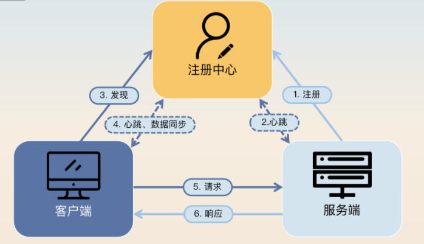

# 服务注册与负载均衡

### 服务注册与发现 

解决的问题：微服务中有很多服务端，客户端需要知道一个请求可以发送给谁，IP地址和端口号是什么。

服务注册步骤：

1. 服务端启动时，在注册中心注册信息
2. 客户端在第一次调用服务端时，从注册中心获取所有可用的服务端节点缓存到本地
3. 服务端和注册中心保持心跳检测，客户端和注册中心也保持心跳检测同时做数据同步。一旦有变动，注册中心通知客户端，客户端更新本地缓存。
4. 客户端发送请求，服务端响应请求。

服务下线步骤：

1. 服务端通知注册中心下线，注册中心通知客户端
2. 客户端的新请求不再发送给该服务端
3. 服务端等一会儿下线

怎么保证高可用？

1. 服务端崩溃检测

   保证高可用需要注册中心尽快发现服务端宕机，突然宕机是来不及通知的。注册中心一旦利用心跳发现服务端宕机，就立马通知给客户端，先尽快保证不要有请求继续发到可能宕机的服务器。但这很可能是偶发的网络不通，服务端没有真的下线，后续要继续重试，心跳恢复立马通知客户端。

   但再怎么做，服务端崩溃到客户端知道，中间有时间差，所以需要客户端容错。（不能盲目重试，这段时延会有大量请求到达错误节点）

2. 客户端容错

   容错是客户端发现一个服务端调不通就换一个节点重试。可以把这个节点移出可用节点列表，当注册中心通知服务端恢复时再放回去，真崩溃就不用放回去了。也可以用心跳机制检测服务器，重试成功了就放回去。

3. 注册中心选型

   CAP理论中，注册中心应该满足的是分区容错性和可用性，数据一致性不太要紧。因为就算注册中心提供的服务节点只是大概率正确也没事，客户端会容错。

   Nacos AP模式，ZooKeeper CP模式，体量小。

### 负载均衡

解决的问题：客户端需要知道把请求发给哪个服务端。

常见算法：

- 静态：轮询、随机、一致性哈希
- 动态：最少连接数（连接复用时不准）、最快响应时间(最近期)

一致性哈希解决了普通哈希中，哈希算法不好时导致的某个节点负载过高的情况。一致性哈希引入了哈希环，将服务器节点映射在哈希环上，根据请求参数计算哈希值，顺着哈希环遇到的第一个节点就是要请求的。

> 实践：
>
> 网关原先采用简单的轮询，但每隔一段时间就有客户反馈响应特别慢。
>
> 剖析原因是有些vip客户有图形推理功能，会占用模型机器大量的内存和CPU，导致其他客户的请求变慢。解决方法是做隔离，给vip客户开几个专门的节点，不要影响旁人。
>
> 后来底层扩展了不少机器，为了提升性能底层也使用了本地缓存，轮询算法在集群节点变化时，大量的请求会被重新路由到新的模型机器，缓存大量失效。
>
> 我把轮询改成了一致性哈希，解决了节点变动平滑过度的问题，最大程度保护本地缓存。最后因为不同模型机器算力不同，所以构建了虚拟节点，一个机器算力越好权重越大，在哈希环上的虚拟节点就越多，自然能承载更多请求。
