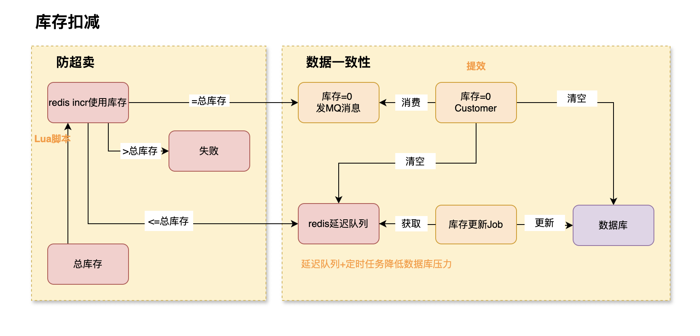
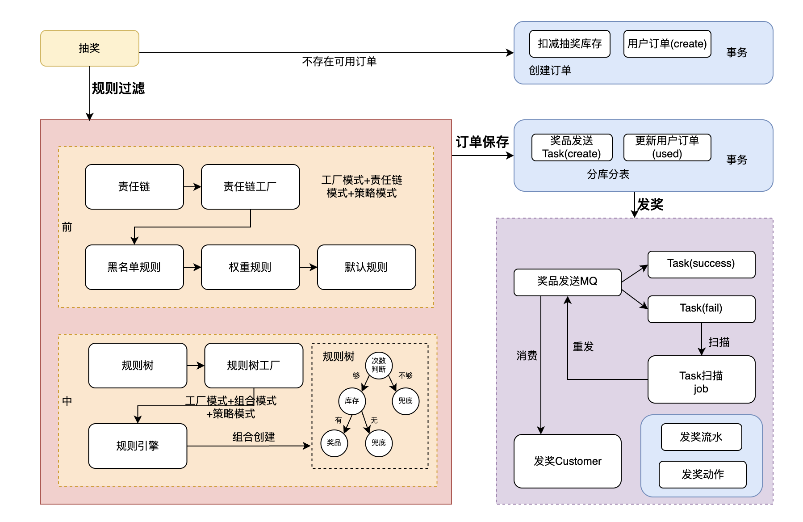
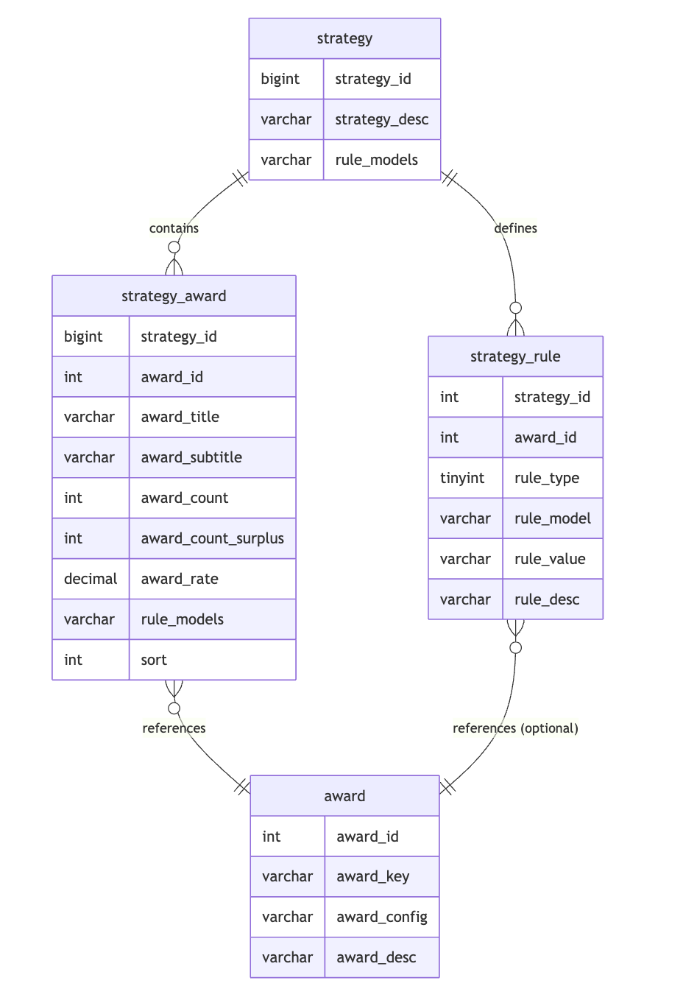
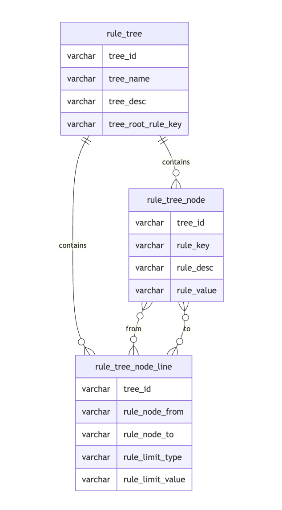

**项目名称：**用户增长与促活平台

**项目简介**：通过积分返利、抽奖活动等营销手段提升用户活跃度与留存，驱动核心业务指标增长。

**项目亮点：**

* 领域驱动设计：采用DDD领域驱动设计，清晰界定活动、抽奖策略、积分等核心领域边界，高内聚低耦合提升系统可维护性和扩展性。
* 流程模板化：使用模版模式定义抽奖流程标准，解耦为前中后三期处理，灵活支持多样化抽奖场景，比如黑名单、不同积分不同奖品，按照次数解锁等。
* 高性能与一致性：Lua脚本+INCR 指令扣减库存防超卖，rocketMQ延迟消息异步落库降低写入压力，引入task表定时扫描校准数据保证最终一致性。
* 动态规则配置：通过责任链模式动态组装抽奖前校验规则（黑名单、权重校验)，通过组合模式将抽奖中规则抽象为规则树（支持数据库配置,动态组装)。
* 稳定性：通过分库分表解决用户行为流水与订单数据的存储问题，完善降级和限流预案保证核心链路稳定性

### 问题总结

1. 你为什么使用DDD架构？

   营销类的需求变更很频繁，常见的MVC架构会使得后期难以维护，比如数据持久化对象会被当做业务对象不断新增字段，会非常混乱。

   项目分成了抽奖、发奖、活动、返利等领域。各领域功能独立，返利领域负责在签到或积分兑换后发放抽奖权益，抽奖领域消耗权益装配多种抽奖策略做抽奖，奖品领域发奖。

   每个领域都有自己的值对象、实体对象和聚合对象，只需要定义数据操作的接口，而具体的数据操作都在基础设施层做，完全分离开业务数据和持久化对象。各领域之间互不引用，应用层使用各个领域的功能完成用户需要的业务功能。

   值对象一般是没有生命周期，不可变的对象，只关注属性，比如说枚举值对象。实体对象一般是有唯一id，状态会随着业务而改变，比如说奖品实体。聚合对象里面放的一般是一个事物中要操作的对象。

2. 如何支持在系统运行中加库存防超卖

肯定是不能直接更新库表的，行级锁会导致大量用户等待。所以需要把库存同步到redis中去。

原先的设计用户体验可能不是很好，运营新增了库存，但因为扣减过的库存值加锁，会导致一直没有库存。

可以在redis中添加两个值，一个是总库存，一个是使用库存。消耗库存时使用lua脚本，获取到总库存和已用库存，已用库存+1后和总库存比较，小于总库存就能用。

(当运营配置库存时，redis总库存增加，使用库存增加后和总库存比，小于总库存可以加。)

3. 责任链模式和组合模式是怎么选择的？

抽奖前，有一些顺序的判断流程，比如说先判断是不是黑名单，不是黑名单就根据积分做不同的奖品权重配置，最后进入默认配置，适合用责任链模式。

抽奖中决策时，需要根据用户抽奖次数和库存是否足够来选择，不同的选择可能都要发兜底奖品，这更接近于一棵树，所以使用了组合模式。在数据库中配置节点和边的流向。

好处是如有有新的抽奖前规则，责任链里面加个节点就行。而如果有新的抽奖中规则，可以创建一颗新的树，或者加入新的节点和连线即可。避免了很多if else的代码，改变范围能缩小到规则引擎处。

4. 项目是怎么部署的

本地构建前后端镜像，push到docker hub，编写docker compose，把需要的mq、mysql、redis等环境部署起来，部署时会自动跑mysql建表语句。

5. 数据基础层的依赖倒置是咋做的，有什么好处？

MVC容易混淆数据库持久化对象和业务对象，后期很难维护。DDD中领域层定义接口，基础层做具体实现，这样数据库持久化对象PO和相关操作都限定在基础层，外部无法直接引入，就防止了混淆。

6. 数据库设计是怎样的？

   数据库里面核心的表就是抽奖类的表。抽奖的规则树有单独的三张表配置树、树节点和连线信息。其他表分别负责策略下奖品库存管理、奖品信息管理和奖品单独抽奖规则。

   此外，我把抽奖次数作为商品，设计了sku表，账户表记录用户获得抽奖次数的流水。

7. 什么问题难住你的时间最长？

从设计来看，库表设计和领域接口拆分最耗时间，努力做到高内聚低耦合，设计的不合理写着写着要继续改。从细节来看，类的名称，入参出参的设计，都要好好考虑，易读性要比较强好理解。最后，每次写一部分功能就要做单元测试，会出现空指针等异常，要断点调试，流程长的情况下也需要花功夫。

8. redis库存和msql库存的一致性

   数据库中的库存是要和redis保持最终一致。

   主要手段是通过异步的方式写入延迟队列，由定时任务消耗然后更新数据库。为了效率更高，一旦库存全部用完，就发送mq消息，消费者收到消息就清空延迟队列，就不用慢慢消耗了，同时把数据库库存也改为0。

   最终兜底的手段是活动结束以后，扫描活动产生的订单，校准库存。

9. 一天抽奖一次怎么设计。

   这个一次的限制应该和活动有关，某次营销活动一天一抽，所以活动应该有额度的表，设置日额度为1。每天第一次抽奖前，会根据额度创建出一条当日的抽奖权益记录，抽奖时消耗这个记录。第二次抽奖今日已有记录就不能再抽了。

10. 为什么要使用setnx防止超卖。

在 redis 集群模式下，主从切换的时候，如果主节点的已用库存还没同步到从节点，主节点挂了，丢失了部分未同步的数据，当前已有库存变少了，如果没有加锁就可能超卖，属于极端情况下的一种兜底策略，有 setNX 锁拦截后，会更加可靠。setNX 的 key 的过期时间可以优化为活动的有效期时间为结束

这导致滑块锁很多怎么办，锁的key加上年月日，每天上一个key。

11.多个定时任务扫描task表导致mq重发怎么办

首先，因为有幂等的ID，就算重发了下游也不会多次处理。

设计一个抢占锁，多个任务抢占同一个锁，谁抢占到了，谁可以执行。 如果抢占的执行失败了，删掉锁，重新执行。如果删锁失败，对于是谁抢占的，谁可以做重入锁，继续执行。 锁有失效时间，如果抢占到的自己挂了，等待锁失效后，重新轮候抢占。