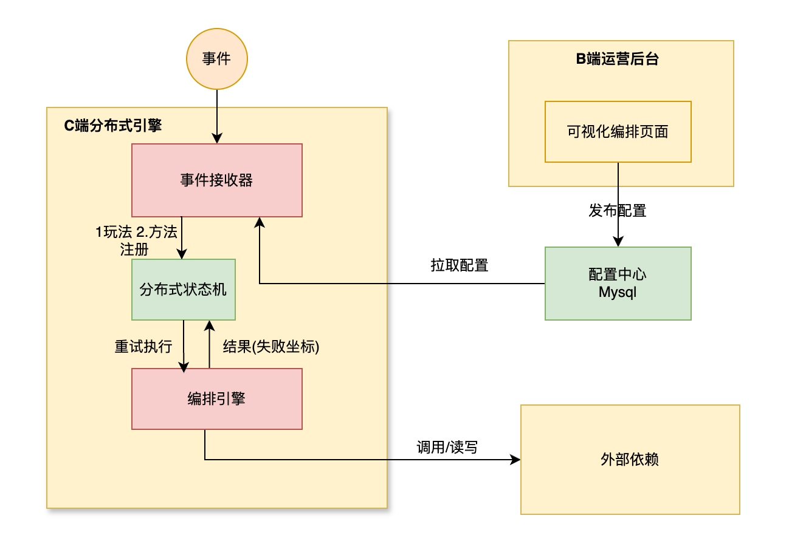
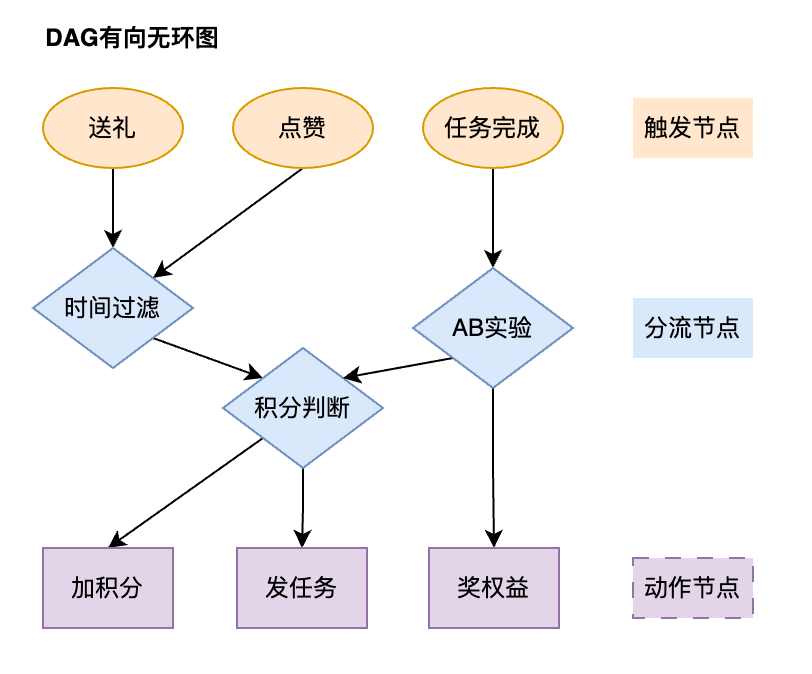

**项目名称**：分布式营销流程编排引擎

**项目简介**：通过抽象和拆解业务流程，构建有向无环图（DAG），实现B端流程编排可视化运营后台，和C端分布式流程编排引擎，支持运营自主上线各类营销活动.

**项目亮点**
* 效率提升：从定制化代码开发 -> 低代码或0代码+配置模式；引擎执行漏斗上报数据中心可视化。
* 一致性：应用本地重试+远程重试，使用分布式状态机组件保证编排引擎执行的最终一致性。
* 最优调度：
  1. 每个子节点起线程并发执行，sync.Map收集结果。
  2. 通过FuncCache缓存同节点同参数结果，避免session内相同节点的请求放大。
  3. 使用聚合工具实现相同接口不同参数的网络请求聚合。
  4. 支持断点续传，从失败节点开始执行远程最小重试，避免重试风暴问题。

### 讲解

这个项目本质上是基于有向无环图的工作流执行引擎。引擎可以处理各种触发事件，根据运营配置的玩法执行一系列节点，比如触发节点、分流节点、动作节点，最终产生任务下发，发放奖励等动作。

营销流程编排引擎解决了新活动开发效率低的问题，把复杂的业务逻辑抽象成可视化的图，能做到低代码甚至0代码开发。

为了支撑海量用户的并发执行，在提升性能方面做了很多设计。比如说引入FuncCache，对相同参数的节点计算只执行一次，同时利用聚合组件将同一时刻对下游相同接口不同参数的请求聚合批量调用，减少网络io。

### 问题整理

* 为什么做这个项目

我在工作中发现有很多业务的代码逻辑差不多但又不完全一样，维护成本有点高。所以决定做一个基建类的产品，让运营自主配置，研发更关注最小的原子能力。

* 如何保证最终一致性

通过重试和幂等两方面来保证。

如果节点执行失败，先本地重试，每个节点内部，下游调用失败时会进行 3 次本地重试，每次重试之间有递增的延迟,本地重试可以应对网络抖动或下游服务的短暂不可用,。如果本地重试失败，状态机会将任务放入延迟队列，每隔 5 秒、30 秒、120 秒重试，直到成功或达到最大重试次数。

所有下游服务的接口都必须支持幂等，对于特别严格的场景，比如扣预算和发奖这种场景，使用TCC分布式事务组件包装成一个分布式事务节点。

* 状态机SDK做什么事情？

SDK收到错误会自动进行重试，无需自己写。

SDK会将引擎执行的上下文持久化，即时重启也能恢复。包括各节点执行结果，执行到哪个节点失败，玩法配置表，参数等信息。

状态机自带管理控制台，可以查看每个流程实例的执行状态，方便运维排查问题。

* 事件接收器做什么事情

接收一个外部事件，找到所有需要被这个事件触发的玩法配置（`PlayConf`），并驱动这些玩法配置对应的流程执行。不是直接调用引擎，而是注册方法到状态机SDK，让SDK间接执行。方法会告诉状态机执行一个节点的具体逻辑，需要获取上下文，寻找开始节点，执行引擎，如果错误了就把失败节点ID写入上下文中。

* 有可能存在多个节点失败的情况怎么办？

没有关系，下一次重试就会从第二个失败的节点开始重试，直到所有节点均成功

* 如果要加新的节点类型怎么办？

目前是使用策略模式，加节点需要加个case，但这么做有点不够单一职责。可以使用工厂模式加注册机制，将每个节点的执行逻辑解耦到不同的文件中。在原先switch处只做统一的转发即可。

* FuncCahe是什么

用于缓存节点执行结果，相同节点相同参数key是一样的。解决session内重复计算的问题,大大减少了对下游服务的调用次数。

公司的组件，是支持LRU淘汰策略和过期时间的并发安全缓存库。不是简单的map，底层可能是并发安全的sync.Map加上TTL的结构。

* “nodeResContainer 为什么选用 sync.Map 而不是普通的 map 加 sync.Mutex？在什么场景下 sync.Map 更有优势？”

这是一个关于并发模型选择的经典问题。我们选择 sync.Map 是经过特定场景权衡的。

执行模型中，每个节点的结果 (NodeRes) 在整个流程的生命周期内通常只被写入一次，但可能在最终组装结果 (ExecFromNode 方法) 时被读取多次。

sync.Map 专门针对这种读多写少且键值对一旦写入就很少更新的场景进行了优化。它在读取时不需要锁，性能远高于 map + sync.Mutex。如果使用 map + sync.RWMutex，即使在读的情况下，也需要获取读锁，在高并发场景下会产生锁竞争。而 sync.Map 内部使用了读写分离和原子操作，对于已存在的键进行读取几乎是无锁的，性能极高。

* 配置改变了怎么办？

  一般是不允许中途变更玩法的，会给用户造成困扰。如果非要改变，由于状态机SDK在执行引擎时，上下文中会存入开始前玩法的快照，这能够保证引擎在一次执行过程中玩法版本的一致性。重试的时候也是使用上次的上下文，所以也不会改变。

* 这个引擎可以用于哪些项目

比如说，鼓励用户成长，当一个用户完成观看视频的任务，如果查到他在新手期，就给他下发一个连续观看3天的任务，完成任务后再给钻石奖励。

比如说鼓励用户下单，如果用户把商品加入了购物车，检查该商品库存够不够，是否参与促销，是的话就给用户发一个优惠券。

* 一个流程可能很长，涉及到异步操作。如果某个节点执行失败，如何保证可靠性。

引擎本身是无状态的，每个节点执行失败，会立即终止执行，当前失败的节点ID和整个上下文信息都会被状态机持久化。状态机拿着失败的节点ID重试，保证从断点执行。

* 如果某个子节点执行特别慢，甚至永远不返回怎么办？

一个慢节点或‘僵尸’节点会拖住整个 WaitGroup.Wait()，导致 goroutine 泄漏，大量请求堆积，最终耗尽系统资源。我会引入一个**带超时控制的** **Context**。为整个 ExecNode 调用设置一个总的超时时间，然后将这个 Context 传递给每一个子 goroutine。如果超时发生，就立即返回错误，放弃所有尚未执行完的子 goroutine，防止资源被永久占用。

* 项目不足

目前的节点类型是硬编码的，每增加一种新的判断逻辑或动作，就需要开发人员编写代码、上线发布。
