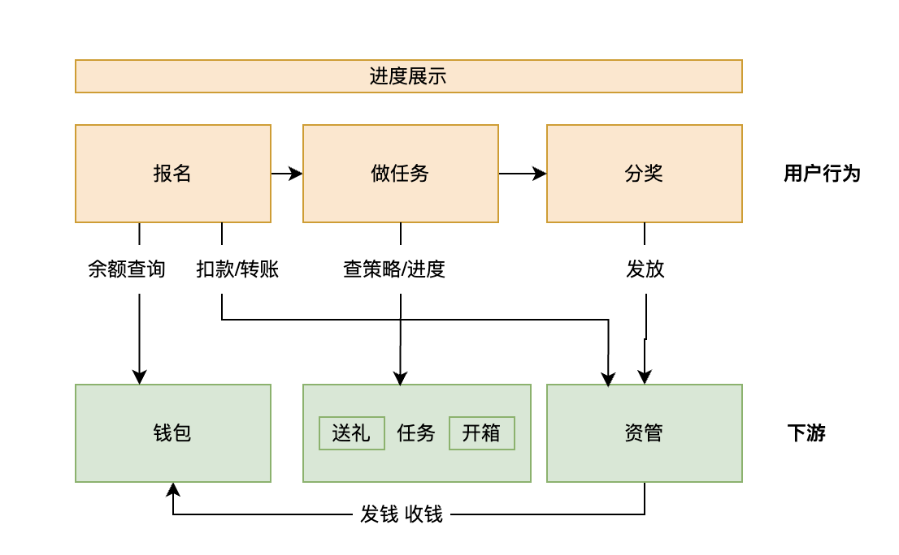
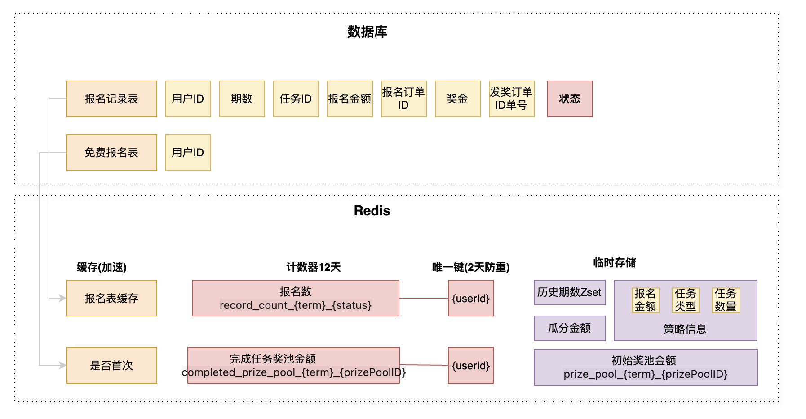

# 金币瓜分赛

**项目名称**：金币瓜分赛

**项目简介：**奖池瓜分玩法分为三个核心流程：用户花金币报名，报名费用投入奖池 -> 分配用户任务，用户开始做任务 -> 完成任务的用户参与奖池瓜分。

**项目亮点**
* 最终一致性：状态机驱动加异步补偿，保障玩法记录、用户账户、平衡账户之间的最终一致性。
* 可重入幂等：报名和瓜分接口均为幂等且可重入设计，Redis Lua脚本保证瓜分场景 0 重复计数0 超发。
* 存储设计：灵活运用redis的缓存、计数、排序等功能；设计差异化的TTL策略匹配业务生命周期；区分冷热数据做差异化查询；空值缓存防穿透；弱依赖与异步化设计保证核心流程可用性；延迟双删保证数据一致性。
* 代码质量：多层次测试策略，包括高并发幂等性测试、数据层与缓存层组件集成测试、AB实验验证等。
* 监控对账：开发旁路链路，针对玩法记录的订单表和转账流水表进行双源对账，差异情况报警并自动补偿。

### 讲解

瓜分赛项目是直播间的一种互动玩法。核心步骤是付费，做任务，瓜分奖池。报名时用户的金币会进入奖池，完成我指定的任务，比如说开宝箱或者送礼物，就能瓜分奖池。为了应对高并发，保证资金安全，我在数据一致性，幂等性，防超发等方面做了一些设计。

### 问题总结

- 你怎么保证用户创建报名记录和资管扣款的一致性。

  这是个典型的分布式事务问题，是用状态机和异步查询补偿来实现的。一条记录的状态在初始化，已付钱，进行中，已完成、已瓜分中流转。我会先创建一条状态为初始化的记录，如果资管系统扣款成功，更新状态为已支付。如果资管系统扣款失败，状态会保持在初始化，重试来修复。重试时，会查询资管转账是否成功，成功就更新状态为已支付，否则就再次尝试调用资管。由于扣款请求会携带唯一的报名订单id，资管系统可以做幂等校验，防止重复扣款。 

- 你是怎么实现可重入，做幂等的。

  数据库有唯一键，如果重复报名，只会创建一行记录，只重试调用其他下游的部分。使用唯一的业务ID和其他系统做交互，保证下游是幂等的。

  如果重复调用到redis，也有唯一键控制只能增加一次。

- 你怎么防超发？

  为了防止超发，要做到两点：1是完成任务的金额累加要正确不能加多，2是用户领奖只能领一次。

  为了金额累加正确，使用了redis的计数器功能，加上辅助的唯一键，使用lua脚本保证原子性，累加奖金时，先判断用户的唯一键是否存在，不存在才累加，否则就是累加过了。

  领奖时采用乐观锁机制，用户第一次领奖会更新数据库领奖金额和领奖订单号，如果重复领奖会返回没有行被更新的特定报错终止流程。

- 用户报名状态是如何流转的？

  读时修复的策略，如果任务在进行中，就实时查询任务完成状态，流转状态为已完成。避免了定时任务扫描，保证了最终一致性。

- 监控对账是怎么做的？

  创建一个定时任务，定期拉取数据库中的报名表和资金系统的流水表，对比金额是否匹配，如果我这边记录是已支付，而资管系统没有成功的流水，就触发报警。当然，也有预设的策略进行自动修复，以资管系统为主，如果资管显示成功，这边还是初始化，自动补偿改为已支付。

- 你怎么做测试？

  通过mock工具隔离外部依赖，包括开关、数据库、缓存和下游RPC。首先保证数据库和缓存组件读写的正确性，然后进行核心功能的验证。举个测试高并发下领奖的例子，因为对接的资管接口具有幂等性，所以mock时不是简单返回true，而是使用lua脚本做了一个简单幂等操作。测试结果用断言来量化，5个并发领奖操作只能加一次。

- redis的TTL是如何设计的？

  Redis TTL的设计并不是一个随意设定的值，而是基于业务生命周期、数据一致性要求和系统资源成本三者之间精细权衡的结果。我的核心原则是：在保证业务功能正确的前提下，让数据在Redis中‘存活’得尽可能合理，既不提前消失导致穿透，也不长期滞留浪费内存。”

  对于过程性缓存（如用户记录），TTL与业务生命周期相关，比如瓜分赛是三天，那缓存的用户记录报名信息TTL为三天。

  对于结果性数据（如计数、奖池），TTL与数据查询需求的生命周期相关，比如计数与金额要满足历史查询，就设置TTL为12，而唯一键只有瓜分过程中实时累加才使用就设置TTL为2。

- 存储有什么设计

    - 基于数据冷热特性的差异化查询策略
      当天的奖池金额随时在变（用户还在报名），而历史期的金额早已固定不变。对于历史期数据：我将其缓存在Redis中，设置较长的TTL。查询时直接读取缓存，这使得对历史数据的查询速度快、且对下游资管系统零压力。对于当天数据：我直接穿透到资管系统查询实时金额，保证数据的绝对准确性。

    - 防止缓存穿透与击穿
      当大量请求查询一个不存在的用户记录时（比如恶意攻击或爬虫），会穿透缓存直接打到数据库，造成巨大压力。缓存空值：即使在数据库中没查到某条记录，我也会在Redis中缓存一个特殊的空值（比如 record{ID: 0}），并设置一个合理的TTL。

    - 保证缓存与数据库最终一致性

      我采用了 “先更新数据库，再删除缓存” 的主策略，并辅以 “延迟双删” 作为补偿机制。

      第一删（立即）：在更新数据库后，立即第一次删除Redis中的缓存。目的是让并发读请求立刻就能发现缓存失效，从而回源到数据库读取最新值。这保证了数据的及时性。

      第二删（延迟）：然后，我异步地启动一个延迟任务（例如1秒后），再次执行删除缓存的操作。 这是为了兜底主从延迟，防止旧值回写。在第一次删除后，如果有一个读请求恰巧发生在旧数据同步到从库之前，它可能会从从库读到旧数据并回写到Redis。延迟双删就是为了清除这个可能被回写的脏数据。

    - 弱依赖与异步化设计

      对于更新Redis计数器、缓存等操作，我将其设计为弱依赖。即使Redis操作失败，也只记录错误日志，而不会让整个核心写事务回滚。

      很多缓存更新操作（如 asyncSetRecordCache）是通过 go func() 异步执行的。

      弱依赖导致的数据不一致怎么解决？读时做校验修复缓存。也可以监控告警人工修复。